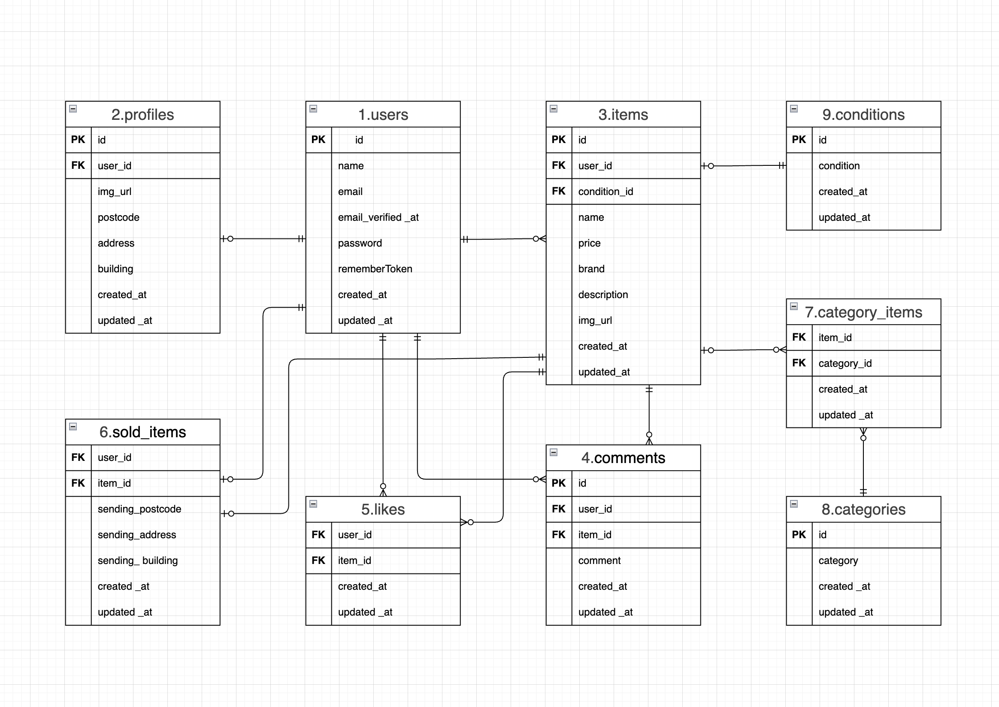
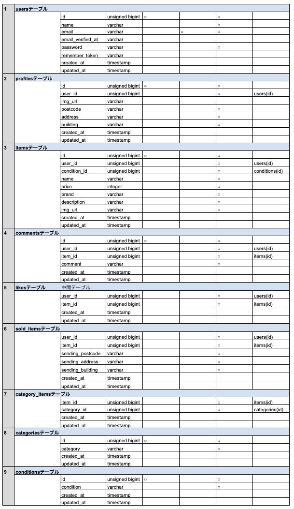

# mogitest_01
模擬案件1回目

・タイトル：実践学習ターム 模擬案件初級_フリマアプリ

・環境構築
 git clone <git@github.com>:km20250118/mogitest_01.git
 DockerDesktopアプリを立ち上げる
 docker-compose up -d --build

・環境構築
Laravel環境構築
1. docker-compose exec php bash
2. composer install
3. cp .env.example .env
4. .env に以下の環境変数を追加
    DB_CONNECTION=mysql
    DB_HOST=mysql
    DB_PORT=3306
    DB_DATABASE=laravel_db
    DB_USERNAME=laravel_user
    DB_PASSWORD=laravel_pass
5. アプリケーションキーの作成
    php artisan key:generate
6. マイグレーションの実行
    php artisan migrate
7. シーディングの実行
    php artisan db:seed
8. シンボリックリンク作成
    php artisan storage:link

・ログイン情報(テストアカウント)
    id：<test@example.com>
    pass：12345678

・使用技術(実行環境)
    Laravel：8.83.29
    Nginx:1.21.1
    php:8.1-fpm
    Mysql:8.0
    phpmyadmin:latest
    mailhog:latest

・URL
   開発環境：<http://localhost/>
   phpMyAdmin:：<http://localhost:8080/>
   MailHog：<http://localhost:8025/>
   stripe:<https://dashboard.stripe.com/acct_1SN3miFbW3HpXmAy/test/dashboard>
          ログインメールアドレス:kiyotaka.moriya@gmail.com
          ログインパスワード:coachtechtest

         Stripe の API キーは以下のように設定をお願いいたします。

        STRIPE_PUBLIC_KEY="pk_test_51SN3miFbW3HpXmAy7HDBoEn13MbwMAbBEkVRYSPEpzuNUkrXRg04LiGLx2KLqurJ8D5GaGFoNNeQ7tVGAtBR4fwg00ScZbVJdi"

        STRIPE_SECRET_KEY="sk_test_51SN3miFbW3HpXmAy3pTjAaJso0nZz8p78PO7boLteFjAwe0wRYd5KQaREG4uAsePJq3RWsbuIq2wFe6QykTGkvGJ00ajgDZu7n"

         テスト決済用カード情報
          カード番号：4242 4242 4242 4242
          有効期限：12/34
          CVC: 123
          郵便番号：12345
・ER図
 
・テーブル設計
 
